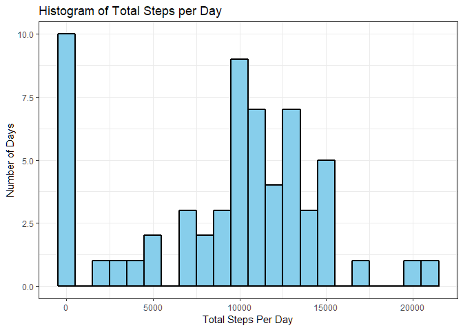
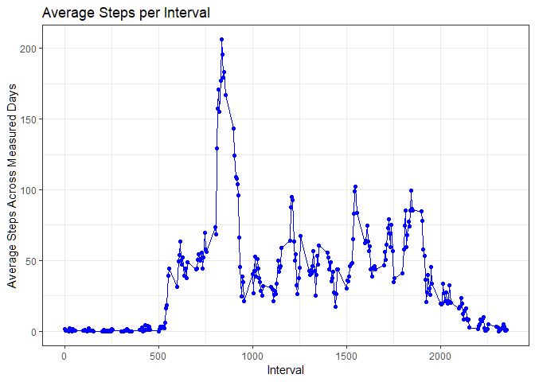
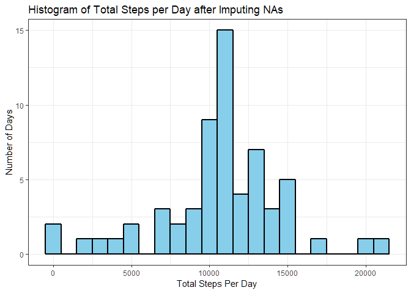
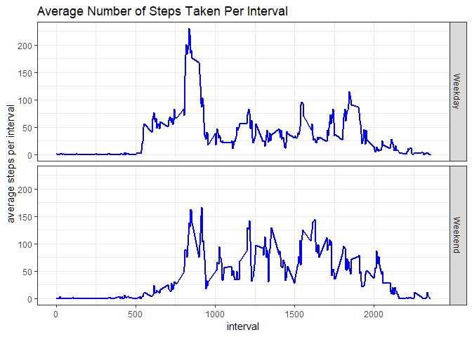

```r
library(dplyr,warn.conflicts=FALSE)
library(ggplot2)
```

##Loading and preprocessing the data

```r
data <- as_tibble(read.csv("activity.csv"))
```

##What is mean total number of steps taken per day?

```r
sum_by_day <- group_by(data, date) %>% summarize(sum=sum(steps,na.rm=TRUE))

plt <- ggplot(data=sum_by_day,aes(sum))+
   geom_histogram(stat = "bin", binwidth=1000, fill="skyblue", col="black", lwd=1)+
   theme_bw()+
   labs(x="Total Steps Per Day",
        y="Number of Days",
        title="Histogram of Total Steps per Day")
print(plt)
```

<!-- -->

```r
cat(sprintf("Median steps per day = %d\n", median(sum_by_day$sum)))
```

```
## Median steps per day = 10395
```

```r
cat(sprintf("Mean steps per day = %f\n", mean(sum_by_day$sum)))
```

```
## Mean steps per day = 9354.229508
```

##What is the average daily activity pattern?

```r
mean_by_interval <- group_by(data, interval) %>% summarize(mean=mean(steps,na.rm=TRUE))

plt2 <- ggplot(data=mean_by_interval)+
   geom_line(aes(x=interval,y=mean),color="blue")+
   geom_point(aes(x=interval,y=mean),color="blue")+
   theme_bw()+
   labs(x="Interval",
        y="Average Steps Across Measured Days",
        title="Average Steps per Interval")
print(plt2)
```

<!-- -->

```r
cat(sprintf("Maximum of 'Average Steps per Interval' = %f\n", max(mean_by_interval$mean)))
```

```
## Maximum of 'Average Steps per Interval' = 206.169811
```

##Imputing missing values
The approach used here is to replace NA's with average of available data in corresponding interval

```r
na_rows <- is.na(data$steps)
num_NA <- sum(na_rows)
cat(sprintf("Number of observations in this dataset = %d\n", nrow(data)))
```

```
## Number of observations in this dataset = 17568
```

```r
cat(sprintf("Number of missing values in this dataset = %d\n", num_NA))
```

```
## Number of missing values in this dataset = 2304
```

```r
# filling in missing steps measurements using average of available data in same interval
data_imputed <- data
na_rownums <- which(na_rows)
# following line finds row in mean_by_interval table that corresponds to the interval associated with each NA
which_mean <- sapply(data$interval[na_rownums],function(x){which(mean_by_interval$interval==x)})
data_imputed[na_rownums,"steps"] <- mean_by_interval$mean[which_mean]
```

Make a histogram of the total number of steps taken each day and Calculate and report the mean and median total number of steps taken per day. Do these values differ from the estimates from the first part of the assignment? What is the impact of imputing missing data on the estimates of the total daily number of steps?

```r
sum_by_day_imputed <- group_by(data_imputed, date) %>% summarize(sum=sum(steps,na.rm=TRUE))

plt3 <- ggplot(data=sum_by_day_imputed,aes(sum))+
   geom_histogram(stat = "bin", binwidth=1000, fill="skyblue", col="black", lwd=1)+
   theme_bw()+
   labs(x="Total Steps Per Day",
        y="Number of Days",
        title="Histogram of Total Steps per Day after Imputing NAs")
print(plt3)
```

<!-- -->

```r
cat(sprintf("Median steps per day after imputing issing values = %f\n", median(sum_by_day_imputed$sum)))
```

```
## Median steps per day after imputing issing values = 10766.188679
```

```r
cat(sprintf("Mean steps per day after imputing missing values = %f\n", mean(sum_by_day_imputed$sum)))
```

```
## Mean steps per day after imputing missing values = 10766.188679
```
After replacing NA values with interval averages, the frequency of zero values dramatically
decreases while the mean frequency dramtically increases. This is because the sum() function 
returns 0 for NA vlaues if na.rm=T is specified. As a result, both the mean and median statistics will 
increase for the summed imputed data becuase there are far fewer zero entries contributing.
It is probably better in most cases to remove the NA entries entirely before processing rather
than letting functions assume values.

##Are there differences in activity patterns between weekdays and weekends?

```r
data_imputed$day_type <- as.factor(ifelse(weekdays(as.Date.character(as.character(data_imputed$date),"%Y-%m-%d")) %in% 
                                   c("Saturday","Sunday"), "Weekend", "Weekday"))

mean_by_interval_daytype <- group_by(data_imputed, day_type, interval) %>% summarize(mean=mean(steps))

plt4 <- ggplot(mean_by_interval_daytype, aes(interval,mean)) +
               geom_line(col="blue", lwd=1) +
               theme_bw() +
               facet_grid(day_type~.) +
               labs(x="interval",
                    y="average steps per interval",
                    title="Average Number of Steps Taken Per Interval")
print(plt4)
```

<!-- -->

End of analysis ##
